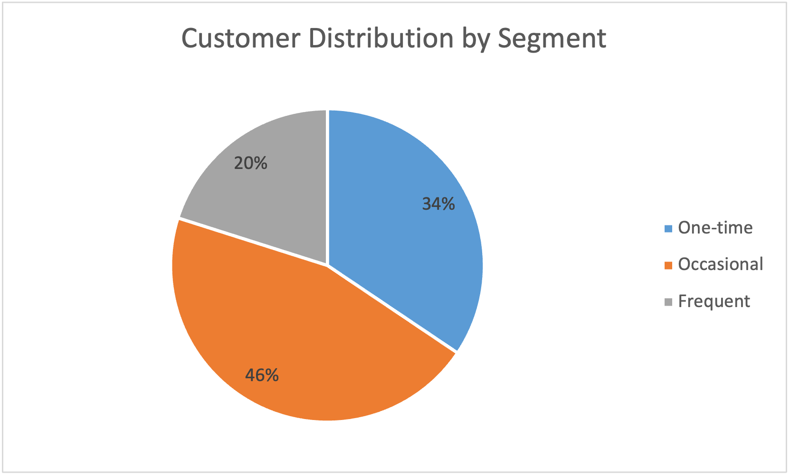
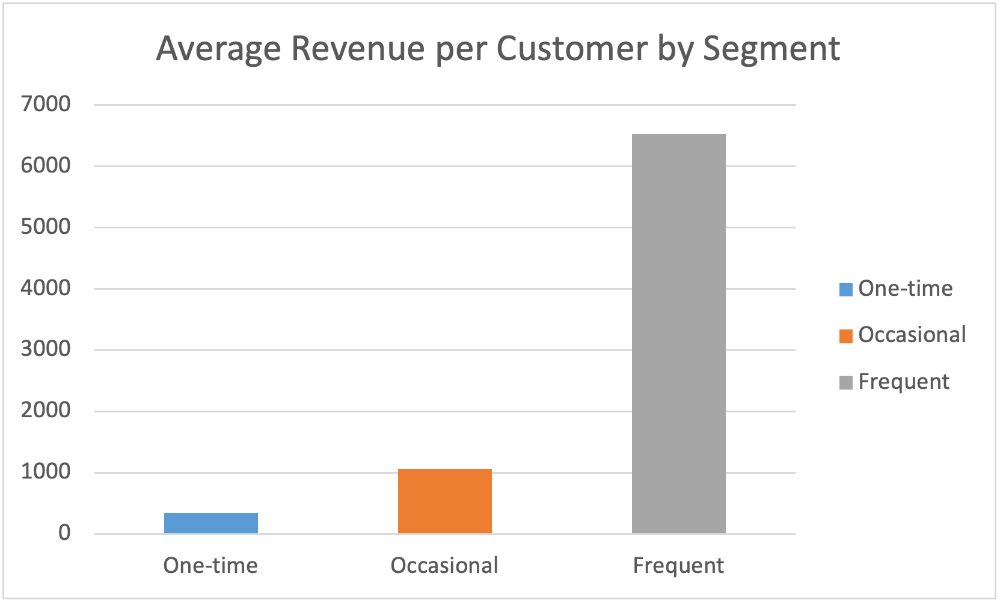

# Customer Segmentation Analysis

Segmentation of 4,339 customers across 500,000+ retail transactions to size the revenue gap between purchase-frequency segments, and the retention opportunity inside it.

## The Dataset

UCI Online Retail Dataset — transaction records from a UK-based online giftware retailer, December 2010 to December 2011. Many of its customers are wholesale buyers rather than individual shoppers.

**Scope after cleaning:** 397,924 transaction rows, 18,536 orders, 4,339 identifiable customers, £8.31M net revenue

**Cleaning applied:**
- Removed rows with no CustomerID (roughly a quarter of the raw file). That's real revenue no customer-level figure here accounts for
- Removed cancellations and returns (negative quantities), which is why net revenue sits about 7% below the gross total
- Counted orders by distinct invoice, not line item. The raw data holds one row per product per invoice, so a single order of 17 products is one order, not 17

## Objective

Segment customers by how often they order, quantify what each segment is worth, and identify where the movable revenue is.

## Method

- Cleaned the raw transaction file as above
- Reduced to one row per order (unique customer–invoice pairs) before counting, so order counts reflect real orders
- Banded each customer: one-time (1 order), occasional (2–5), frequent (6+)
- Summed revenue per customer, then averaged within each band

## Key Findings

**Segment breakdown:**
- One-time (1 order): 1,494 customers (34%)
- Occasional (2–5 orders): 1,973 customers (46%)
- Frequent (6+ orders): 872 customers (20%)

**Average revenue per customer:**
- One-time: £348.80
- Occasional: £1,063.27
- Frequent: £6,526.99

## Insights

**1. Most customers don't come back**

Only 20% of customers placed six or more orders, and a third ordered once and never came back. Most of the customer base sits below the frequent tier, which is the retention problem worth solving.

**2. The customers who do return are worth far more**

A frequent customer is worth £6,527 on average, against £1,063 for an occasional one and £349 for a one-time buyer. Frequent buyers are worth 6.1x an occasional customer and 18.7x a one-time one. Revenue rises steadily with frequency, with no crossover between bands. That's what you'd expect, and it wasn't true of an earlier version of this analysis, before the order counts were corrected.

**3. The occasional segment is where the movable money is**

The gap between an occasional customer and a frequent one is £5,464. There are 1,973 occasional customers already ordering more than once. Converting 20% of them into frequent buyers would be worth approximately £2.16M.

That figure is opportunity sizing, not a forecast. It's the size of the prize if a fifth of the occasional segment moved up a tier, which is what tells you whether the retention question is worth investing in. It doesn't assume the conversion is easy or free.

## Business Implications

**The challenge is retention, not acquisition.** With 80% of customers below the frequent tier and frequent buyers worth six times an occasional buyer, the money is in moving existing customers up, not only in finding new ones.

**The occasional segment is the target.** 1,973 customers, already buying, £5,464 each below the frequent benchmark. Understanding what stops them short of six orders is a narrower and more answerable question than broad acquisition.

**Frequency alone is a blunt segmentation.** A next step would add order value, separating large infrequent buyers from small frequent ones. Those are likely different behaviours that need different handling.

**The excluded 25% matters.** A quarter of transaction rows have no customer attached. If those skew toward any order size or period, every figure here shifts.

## Next Steps to Investigate

1. Order-value distribution within each frequency band
2. Revenue concentration across the top customers
3. What distinguishes an occasional customer who reaches six orders from one who stops at five
4. Whether the unattributed 25% of rows differs systematically from the rest

## A Note on Method

Counting orders correctly matters here. Because the raw data stores one row per product, a naive count treats a single basket of 17 items as 17 orders and badly distorts the segments. This analysis counts distinct invoices, and the workbook keeps the live formulas so every figure traces to its calculation.

I later rebuilt the order count independently in Power Query, removing rows with no CustomerID and cancelled orders, then grouping by invoice. It landed on the same 18,536 orders. Revenue came out about 7% higher than the £8.31M reported here. The gap traces to non-product line items, postage charges and manual price adjustments, that this second pass didn't filter out separately. Order count was the figure I built the check to confirm, and it held.

## Tools & Methods

- Microsoft Excel for cleaning, analysis, and charting
- PivotTables for order and revenue aggregation
- VLOOKUP, COUNTIF, AVERAGEIF for segmentation and per-band figures
- Remove Duplicates to reduce line items to distinct orders
- Power Query, used to independently verify the order count and revenue cleaning logic

## Files

- `Online_Retail_Analysis_Rebuilt.xlsx` — full analysis with live formulas, pivots, and charts
- `Customer_Distribution_Chart.png` — customer count by segment
- `Customer_Value_Chart.png` — average revenue by segment
- `README.md` — project documentation

---

Built: January 2026 · Rebuilt: July 2026

Skills: Excel · Customer Segmentation · Data Cleaning · Business Analysis
